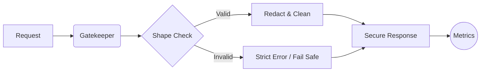

# 🚀 Professional Node.js Backend Toolkit

A collection of production-grade NPM packages designed for high-performance monitoring, security, and data integrity.

---

## 📊 1. API Response Monitor
**The "Must-Have" Middleware for Production Visibility**

[](https://www.npmjs.com/package/@sannuk792/api-response-monitor)
[](https://www.npmjs.com/package/@sannuk792/api-response-monitor)


### 💡 Why it exists?
Debugging production APIs is hard. Traditional logs are scattered and lack context. This package provides:
- **Tracing**: Auto-generated `requestId` in every response.
- **Observability**: Built-in slow endpoint detection and error alerts.
- **Performance**: Negligible ~0.2ms overhead with a "Minimal Mode" for high-traffic apps.
- **Dashboard**: Professional React-based analytics UI.

**[View on NPM](https://www.npmjs.com/package/@sannuk792/api-response-monitor)** | **[GitHub Repo](https://github.com/sannuk79/ApiMonitor)**

---

## 🛡️ 2. Payload Guard
**Lightweight, Zero-Dependency Shape-based Filtering & Sanitization**

[](https://www.npmjs.com/package/payload-guard-filter)
[](https://www.npmjs.com/package/payload-guard-filter)


### 🛡️ Workflow Overview


### ✨ Top Features
- **Shape-based filtering** — Auto-remove unexpected fields.
- **Security First** — `password`, `token`, `secret` automatically removed.
- **Blazing fast** — Sub-millisecond overhead (faster than Zod/JOI).
- **Fail-Safe** — Non-blocking design never crashes your production app.

**[View on NPM](https://www.npmjs.com/package/payload-guard-filter)** | **[Usage Guide](#)**

---

## ⚡ Performance Comparison

| Feature | API Response Monitor | Payload Guard |
|-----------|-----------------------|---------------|
| **Primary Goal** | Monitoring & Tracing | Sanitization & Security |
| **Overhead** | ~0.2ms | <0.1ms |
| **Dashboard** | ✅ Included | ❌ N/A |
| **Dependencies** | Minimal | 0 (Zero) |
| **Use Case** | Lifecycle Tracking | Input/Output Safety |

---

## 📦 Getting Started

```bash
# Monitoring for Express
npm i @sannuk792/api-response-monitor

# Security & Sanitization
npm i payload-guard-filter
```

### Recommended Production Combo
Build a hardened API in minutes:
```javascript
const { apiMonitor } = require('@sannuk792/api-response-monitor');
const { guard } = require('payload-guard-filter');

app.use(apiMonitor({ mode: 'minimal' })); // Global Monitoring
app.post('/login', (req, res) => {
  const safeData = userShape(req.body);   // Precise Filtering
  res.json(safeData);
});
```

---

<p align="center">
  Made with ❤️ by <strong>sannuk792</strong>
</p>