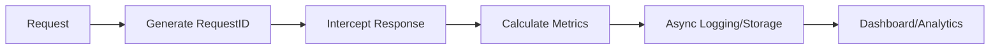
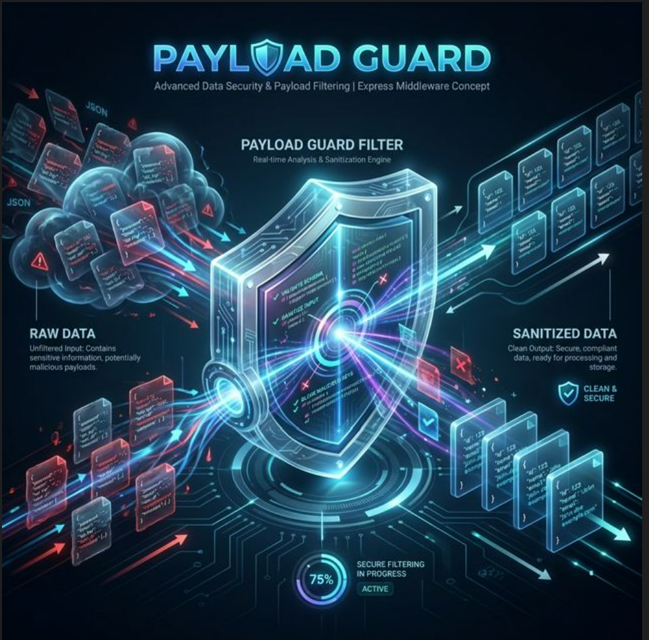
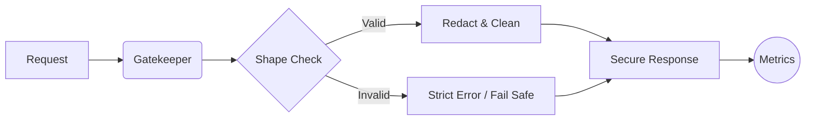
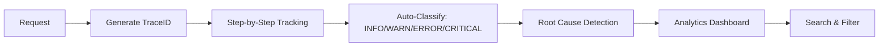

# 🚀 Sannu Kumar - Full-Stack & Systems Engineer

> **Portfolio:** [sannu-portfolio.vercel.app](https://sannu-portfolio.vercel.app/portfolio) | **Catalog:** [Projects Catalog](https://sannu-portfolio.vercel.app/portfolio/projects)

Welcome to my professional laboratory. Here, I build production-grade NPM packages, enterprise-scale web applications, and high-performance mobile solutions.

---


## 💎 Featured NPM Packages

### 📊 1. API Response Monitor
**Debug production API issues in seconds with request tracing and slow endpoint detection.**

[](https://www.npmjs.com/package/@sannuk792/api-response-monitor)
[](https://www.npmjs.com/package/@sannuk792/api-response-monitor)


### � Workflow Overview


- **Production Tracing**: Auto-generated `requestId` in every response.
- **Protocol Metadata**: Built-in SDK version, platform, and service tagging for microservices.
- **Hardened Stability**: Verified with a **14-point stress test** (100 req/sec, circular ref protection, middleware isolation).
- **Advanced Monitoring**: Built-in slow endpoint detection & health metrics.
- **Fail-Safe Design**: Monitoring logic never blocks or crashes your API.
- **Non-Blocking**: Non-allocation fast paths with ~0.2ms overhead.


### ⛑️ Maintained actively.
**Bug fixes usually within 24–48 hours.**


**[View on NPM](https://www.npmjs.com/package/@sannuk792/api-response-monitor)** | **[Source Code](https://github.com/sannuk79/ApiMonitor)**

---

### 🛡️ 2. Payload Guard
**Lightweight, zero-dependency shape-based filtering & sanitization.**

[](https://www.npmjs.com/package/payload-guard-filter)



### �️ Workflow Overview


- **Shape-based Filtering**: Define what you want, auto-remove everything else.
- **Sensitive Protection**: `password`, `token`, `secret` auto-redacted.
- **High Performance**: Optimized schema compilation for sub-millisecond execution.

**[View on NPM](https://www.npmjs.com/package/payload-guard-filter)**

---

### 🔍 3. Flow Debugger
**Production-safe request tracing with root cause detection and live analytics dashboard.**

[](https://www.npmjs.com/package/flow-debugger)
[](https://github.com/sannuk79/debugerpackages)


### 🔄 Workflow Overview


**Key Features:**
- **Zero-Config Setup**: Only **3 lines of code** needed for beginners to get full tracing & dashboard.
- **Auto-Instrumentation**: MongoDB, MySQL, PostgreSQL, Redis, Fetch, Axios — zero code changes
- **Waterfall View**: (New v1.1.0) High-res visual timeline of every request step.
- **Python Support**: (New v1.1.0) Cross-language tracing for Flask/FastAPI services.
- **Root Cause Detection**: Timeout → Failure → Slow bottleneck algorithm
- **Live Dashboard**: Real-time analytics at `/__debugger/dashboard`

**Performance:**
- **Load Tested**: 56,000 requests in 10s (100 concurrent connections)
- **Throughput**: 5,600 req/sec
- **Overhead**: <1ms per request

**[View on NPM](https://www.npmjs.com/package/flow-debugger)** | **[Source Code](https://github.com/sannuk79/debugerpackages)**

---

## 📂 Project Catalog

A selection of production-grade applications and experimental prototypes.

| Project | Category | Description | Tech Stack |
|:---|:---|:---|:---|
| **DRIVERRUNNER** | Mobile | Complete Ride Sharing Platform with real-time tracking & payments. | Node, Mongo, RN, Socket.IO |
| **SHOPMIND AI** | Web | AI-powered price comparison with Rust-accelerated scraping. | Next.js 15, FastAPI, Rust |
| **URBANCRUISE LMS** | Web | Enterprise Lead Management System with real-time visualization. | Next.js, Express, MySQL |
| **TASKVISTA** | Web | Team Management Dashboard for developer communities. | React, Kendo UI, Tailwind |
| **BIOMETRIC AUTH** | Tools | WebAuthn system for passwordless fingerprint login. | WebAuthn, React 19, Security |
| **API MONITOR** | Tools | The official NPM package for API latency and health tracking. | NPM, Node.js, Metrics |

### ✨ Project Deep Dives

#### 🚕 [DriverRunner](#)
A comprehensive ride-hailing solution featuring 3 separate apps. Includes OTP-based authentication, real-time driver tracking (React Native Maps), and live booking systems via Socket.IO.

#### 🤖 [ShopMind AI](https://shopmind-ai.vercel.app/)
Intelligent price comparison platform. Uses Rust-accelerated scraping engines for speed and WebAuthn for biometric fingerprint login.

#### 📊 [UrbanCruise LMS](https://lms-leadmangsystem.vercel.app/)
Enterprise-grade lead tracking system. Handles multi-source collection (Meta, Google Ads) with real-time dashboards using Recharts and role-based access control.

---

## ⚡ Performance Benchmarks

### 🛡️ Payload Guard (Production Scale)
| Benchmark | ops/sec | avg (ms) |
|-----------|---------|----------|
| **Small payload** | 449,365 | **0.0022ms** |
| **Medium payload** | 7,791 | **0.1284ms** |
| **Large payload** | 246 | **4.0724ms** |

### 📊 API Monitor (Middleware Overhead)
| Metric | Full Mode | Minimal Mode |
|-----------|---------|----------|
| **Latency** | ~0.18ms | **<0.05ms** |
| **Throughput** | 50k+ RPM | 100k+ RPM |

---

## 🛠️ Combined Usage

Build a hardened, monitored, and debuggable API:
```javascript
const { apiMonitor } = require('@sannuk792/api-response-monitor');
const { guard } = require('payload-guard-filter');
const { flowDebugger } = require('flow-debugger');

const debugger_ = flowDebugger({ environment: 'production' });

app.use(apiMonitor({ mode: 'minimal' }));  // Global Monitoring
app.use(debugger_.middleware);              // Request Tracing

app.post('/api/secure-data', (req, res) => {
  const safeBody = userShape(req.body);     // Precise Filtering
  res.json(safeBody);
});

// Dashboard: http://localhost:3000/__debugger/dashboard
```

---

<p align="center">
  Connect with me on <strong>[Portfolio](https://sannu-portfolio.vercel.app/portfolio)</strong>
  <br>
  Made with ❤️ for High-Performance Systems
</p>